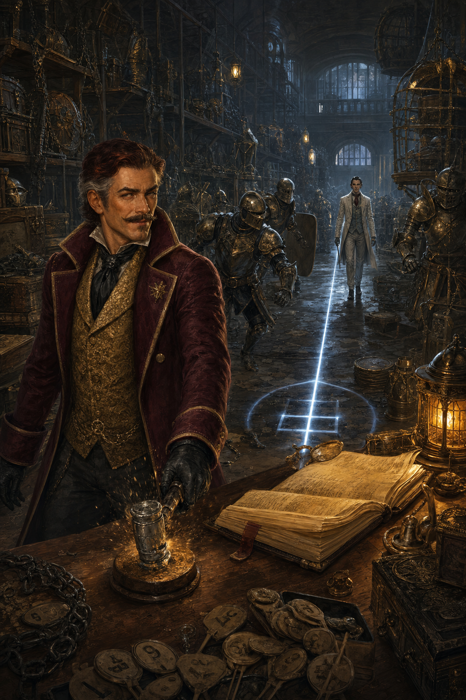
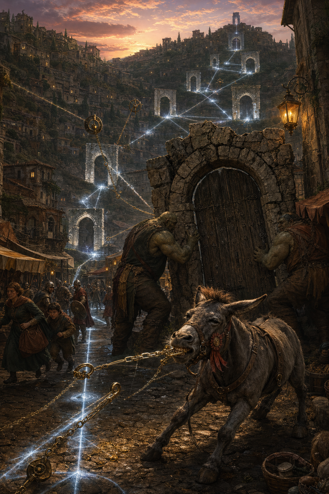
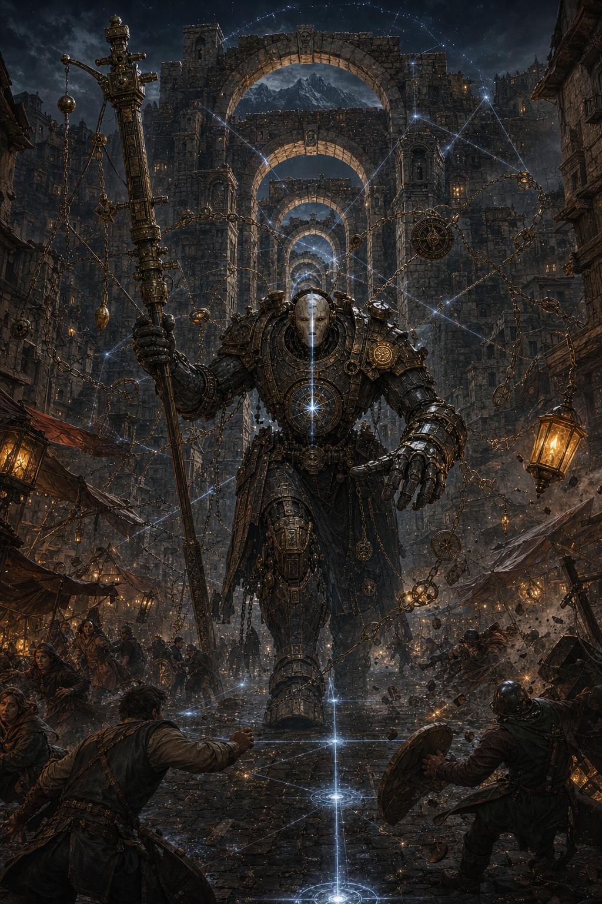

# Guía rápida de dirección — Miravalle, continuidad y cierre

Campaña: **La Fuente del Norte**  
Tramo: **Ciudad I — Miravalle**  
Nivel sugerido: **5**  
Estado de la mesa: **ogros y mula completados; Calo Bronce pendiente**  
Objetivo de la próxima sesión: **resolver el Depósito Nueve, hacer converger las pistas y cerrar Miravalle con un enfrentamiento poderoso**.

---

## La verdad del arco en una frase

El Consorcio Áureo creó escasez para cobrar por los caminos; la Línea Recta quiere aprovechar esa infraestructura para convertir las siete posibles salidas de Miravalle en una sola ruta controlable. **Calo es la bisagra involuntaria entre ambos planes, no la prueba de que las facciones trabajen juntas.**

## Recapitulación de treinta segundos

Podés abrir la próxima sesión con esto:

> “Liberaron el camino de los falsos peajes, descubrieron que el Consorcio estaba detrás de los bandidos y consiguieron a Duquesa, una mula con criterio propio y pésimo carácter. En la subasta apareció un mapa verdadero, la Línea Recta intentó llevárselo y, durante el caos, Calo Bronce huyó con el dinero y las paletas de los postores. Calo todavía está en Miravalle. Y esta noche alguien está comprando puertas.”

No hace falta volver a explicar las misiones completas. Recordá solo tres imágenes: **el sello del peaje**, **los tres golpes de Calo** y **Duquesa mordiendo a un mensajero**.

## Mapa rápido de conexiones

| Lo que ya ocurrió | Lo que significaba | Cómo vuelve ahora | Pago durante el final |
|---|---|---|---|
| Brom y Gruda cobraban un peaje falso | El Consorcio desviaba caravanas hacia rutas propias | El libro de pagos lleva el código **F-7**, “aforo de siete puertas” | Los ogros o su sello anulan la recaudación defensiva del jefe |
| El grupo ganó o adoptó a Duquesa | La mula odia a quien roba o esconde propiedad ajena | Muerde al correo de Calo y luego reconoce las cadenas de agrimensura | Duquesa rompe una cadena y desactiva el ataque que inmoviliza |
| La Línea Recta buscó el mapa | No desea vender rutas: quiere reducirlas a resultados previsibles | Su agente, **Silex Varo**, busca la página de las siete puertas | El mapa permite ver un ángulo seguro y abrir una puerta cerrada |
| Calo robó paletas y dinero | El Consorcio estaba catalogando deseos, compradores y rutas | El Inventario revela que seis puertas ya tienen concesiones comerciales | La página o el martillo desactivan la reacción predictiva del jefe |
| Pero Vintia perdió una carta | Parecía un salvoconduct común | Es el título mágico que mantiene pública la séptima puerta | Recuperarla debilita al Agrimensor antes del combate |

## Qué sabe cada uno

| En mesa | Verdad para el DM | Cuándo revelarla |
|---|---|---|
| El Consorcio estaba detrás del peaje | Está comprando derechos de paso sobre seis puertas de Miravalle | En el Depósito Nueve, sin exigir tirada |
| La Línea Recta quiso el mapa | Necesita información del Consorcio para saber qué puerta forzar | Cuando Silex intente llevarse la página del inventario |
| Calo trabaja para el Consorcio | Calo no conoce el plan completo y odia que lo usen sin pagarle | Durante la negociación con Calo |
| Nerin altera mapas y contratos | Es una llave causal, pero todavía nadie comprende por qué | Mostrá efectos; no expliques su origen divino |
| Las facciones coinciden en Miravalle | Compiten: el Consorcio quiere muchas rutas cobrables; la Línea, una sola ruta inevitable | Debe quedar claro antes del jefe final |

## Orden recomendado para la próxima sesión

Duración estimada: **4 a 5 horas**.

1. **Recapitulación y mordida del mensajero — 10 minutos.** Duquesa entrega el vale del Depósito Nueve.
2. **El tercer golpe — 60 a 90 minutos.** Investigación breve, entrada al depósito, conversación o pelea de tres bandos.
3. **Consecuencias — 15 minutos.** El grupo decide qué hacer con Calo y obtiene la página “Concesiones de entrada”.
4. **La carta que no llegó — 40 a 60 minutos.** Descubren qué es la séptima puerta e intentan recuperar su título.
5. **La noche de la Línea Única — 75 a 100 minutos.** Crisis de las puertas y combate contra el Agrimensor Imposible.
6. **Salida — 10 minutos.** Recompensas, nivel 6 y ruta hacia Lanterra.

Si solo tenés **3 horas**, hacé que la página del inventario esté a la vista, reducí la búsqueda de la carta a una persecución y empezá el combate final con uno de los tres anclajes ya roto.

## Reloj de las siete puertas

Usá este reloj solo cuando el grupo descanse durante la crisis, falle de forma costosa o entregue voluntariamente una pista. **No avances el reloj porque investiguen o hagan preguntas.**

| Marca | Qué cambia |
|:--:|---|
| 0 | Calo todavía está cerrando el inventario |
| 1 | Silex roba o copia la página de las concesiones |
| 2 | Seis cadenas de agrimensura aparecen en la ciudad |
| 3 | La séptima puerta empieza a moverse; la gente evacua |
| 4 | El Agrimensor Imposible despierta y comienza el final |

El reloj ordena el ritmo; no decide el resultado. Aunque llegue a 4, las pistas siguen disponibles y la historia continúa.

## Regla de las tres pistas

No escondas ninguna revelación necesaria detrás de una sola tirada.

| Revelación | Pista 1 | Pista 2 | Pista 3 |
|---|---|---|---|
| Calo está en el Depósito Nueve | Vale mordido por Duquesa | Cera gris con sol partido | Timo reconoce el tercer golpe |
| Hay siete concesiones de puerta | Página del inventario | Libro F-7 de los bandidos | Registro de Pero Vintia |
| La Línea Recta secuestra el plan | Trazo blanco sobre la página | Silex busca solo esa hoja | El mapa se vuelve una línea rígida |
| La séptima puerta es la clave | Carta perdida de Pero | Lira conserva una copia | Duquesa tira de la séptima cadena |

Una tirada exitosa da **ventaja, rapidez o contexto**. La información mínima aparece de todos modos.

---

## Resumen para abrir la sesión

Miravalle es una ciudad fronteriza hecha de puertas, peajes, carteles contradictorios y gente que cree que todo viajero trae una historia, una deuda o una señal.

El grupo necesita **2 Puntos de Travesía** para salir hacia Lanterra. Al llegar, tiene tres oportunidades claras:

1. Resolver el bloqueo del camino norte: **El peaje de los ogros educados**.
2. Conseguir un mapa raro: **El mapa inútil que no lo es**.
3. Participar en un concurso de tartas: **La mula del concurso**.

Nerin no debe resolver nada. Su función es abrir puertas raras, meter al grupo en escenas útiles y recordar el tono de casualidad viva.

---

## Lista de cosas importantes que no debo olvidar

- El grupo necesita juntar **2 Puntos de Travesía**.
- El **Consorcio Áureo** está encareciendo rutas de forma indirecta.
- La subasta también sirve al Consorcio para construir un **Inventario de Deseos Menores** con los nombres y ofertas de los postores.
- La **Línea Recta** aparece por primera vez interesada en mapas y rutas al norte.
- El mapa de Fulka es real: viene de una copia menor del **Mapa Palimpsesto de Metusta**.
- Cuando Nerin se acerca al mapa, aparece una **gota de agua que cae hacia arriba**.
- Duquesa, la mula, debe quedarse con Nerin aunque el grupo gane o pierda el concurso.
- Brom y Gruda no son villanos profundos: son ogros usados por gente más lista y peor.
- El tono ideal de Miravalle: comedia de burocracia absurda + peligro real debajo.

---

## PNJ de uso rápido

### Nerin Fortuna

**Uso en mesa:** brújula rota, no solución.  
**Frase útil:** “Papá dice que las mejores rutas son las que se pagan solas.”  
**Si la escena se traba:** Nerin se equivoca de puerta, compra algo inútil o saluda a la persona incorrecta.

### Alguacil Toren Barda

Autoridad local honesta y cansada. Quiere que el camino norte deje de ser un problema.  
**Ofrece:** ayuda oficial, pase temporal o 1 Punto de Travesía si despejan el camino.

### Bruna Salvecamino

Dueña de la posada El Gallo Azul. Excontrabandista, práctica, protectora cuando nadie mira.  
**Uso:** dar rumores, advertir sobre el Consorcio, aterrizar la sesión.

### Fulka Tresdientes

Vendedora de mapas falsos y verdaderos mezclados. Rápida, graciosa, difícil de intimidar.  
**Tiene:** el mapa real, aunque cree que puede ser solo una rareza vendible.

### Timo “Dos Veces” Lerr

Estafador recurrente. Se presenta con nombres falsos.  
**Uso:** complicar subasta, robar receta, aparecer como alivio cómico.

### Calo Bronce, el Martillo Afable

Subastador elegante, liquidador irregular del Consorcio y exmiembro de las Cartas Inclinadas. Dirigió la subasta con licencia falsa y escapó con la recaudación.  
**Uso:** villano mercantil recurrente, fuente de información o aliado contra un enemigo que quiera eliminar toda negociación.  
**Frase útil:** “No desaparecí con el dinero. Cerré la operación antes de que el mercado perdiera confianza.”

### Silex Varo, el Agrimensor Blanco

Agente de la Línea Recta presente en la subasta. Correcto, sobrio y convencido de que toda bifurcación es una forma de negligencia.  
**Uso:** dar rostro al plan inmediato sin exponer todavía a Maer Senn.  
**Frase útil:** “No estamos comprando Miravalle. Estamos corrigiéndola.”

### Brom y Gruda

Ogros cobradores de peaje. Usan un manual de impuestos de Dirinham que no entienden.  
**Clave:** si el grupo los trata como personas y no solo como monstruos, pueden cambiar de bando.

### Duquesa

Mula terca, inteligente y con odio instintivo a los ladrones.  
**Regla de oro:** si alguien intenta robar cerca de ella, Duquesa lo muerde, patea o delata.

### Agrimensor Imposible

Antiguo Contador de Caminos de Miravalle, convertido en máquina de imposición por las concesiones del Consorcio y la magia de la Línea Recta.  
**Uso:** jefe final y demostración física de lo que significaría un mundo sin alternativas.

---

## Estructura sugerida si dirigís Miravalle desde cero

Si tengo **3 a 4 horas**, conviene correr:

1. Llegada breve a Miravalle.
2. Misión 1 o Misión 2 como escena principal.
3. Misión 3 como cierre cómico o escena corta.
4. Teaser final: alguien menciona a Maer Senn o aparece el símbolo de la Línea Recta.

Si los jugadores persiguen de inmediato al subastador, reemplazá la Misión 3 por **El tercer golpe** y dejá el concurso de tartas para la próxima sesión.

Si tengo **5 a 6 horas**, puedo correr las tres misiones:

1. Abrir con el problema de los peajes.
2. Volver a la ciudad con recompensa.
3. Subasta del mapa.
4. Persecución del subastador en **El tercer golpe**.
5. Concurso de tartas para cerrar con Duquesa si queda tiempo o si la mesa necesita bajar tensión.

---

# Misión 1: El peaje de los ogros educados

## Propósito de la misión

Abrir el camino norte, presentar la economía de viaje y mostrar que el Consorcio Áureo manipula rutas sin dar la cara.

## Gancho para decir en mesa

El camino norte está bloqueado por dos ogros sentados junto a una barrera pintada a mano. Uno sostiene un manual de impuestos de Dirinham al revés. El otro tiene una bolsa llena de monedas, botones, piedras bonitas y una cuchara.

Uno gruñe:

> “Por uso excesivo de piernas, tres monedas. Por cara de héroe, cinco. Por queja administrativa, disculpa escrita.”

## Qué está pasando realmente

Brom y Gruda cobran peajes absurdos porque unos bandidos del Consorcio les dijeron que eso los convertía en “funcionarios de ruta”. Los bandidos usan a los ogros como fachada para encarecer el viaje y empujar a todos hacia caravanas controladas por el Consorcio.

## Información que el grupo puede descubrir

- Los ogros no entienden el manual.
- Los bandidos se quedan con casi todo lo cobrado.
- Hay marcas de caravana del Consorcio cerca del campamento.
- Brom intenta rimar palabras cuando se pone nervioso.
- Gruda sabe contar hasta cinco, pero después usa categorías emocionales: “mucho”, “demasiado”, “sospechoso”.

## Escenas posibles

### 1. Negociación absurda

Usar si el grupo habla primero.  
CD sugeridas:

- Persuasión CD 13 para que Brom admita que no entiende el manual.
- Engaño CD 14 para inventar una cláusula burocrática.
- Intimidación CD 15 para asustarlos, pero si falla los ogros se ofenden y llaman a los bandidos.
- Interpretar el manual con Inteligencia CD 12 para encontrar una contradicción.

### 2. Infiltración al campamento

Usar si el grupo sigue a los cobradores o pregunta quién los emplea.

Detalles del campamento:

- Un cartel dice “Oficina Provisional de Optimización de Ruta”.
- Hay cajas con sello del Consorcio Áureo parcialmente raspado.
- Un bandido lleva una libreta con pagos y sobornos.

### 3. Combate

Encuentro sugerido:

- 2 Ogres.
- 1 Bandit Captain.
- 6 Bandits.
- 2 Scouts o Wererats.

Si querés hacerlo menos letal, los ogros pueden cambiar de bando en ronda 2 o 3 si descubren que fueron estafados.

## Casualidad de Nerin

Nerin escucha a Brom rimar “peaje” con “brebaje” y le pregunta si escribe poesía. Brom se avergüenza. Esto permite:

- abrir negociación,
- distraer a un ogro,
- hacer que Brom dude de los bandidos,
- convertirlo en aliado reacio.

## Recompensas

- 1 Punto de Travesía.
- Pase temporal por el camino norte.
- Gratitud del Alguacil Toren.
- Brom y Gruda pueden reaparecer como guardias honestos, terribles con los números.

## Si la escena se estanca

Hacer que un bandido llegue y maltrate verbalmente a los ogros. Eso deja claro que Brom y Gruda son usados, no líderes.

---

# Misión 2: El mapa inútil que no lo es

## Propósito de la misión

Introducir la carrera hacia la Fuente, mostrar la primera señal fuerte del Mapa Palimpsesto y presentar a la Línea Recta como amenaza elegante.

## Gancho para decir en mesa

Fulka Tresdientes anuncia una subasta en el Mercado de Reliquias Casi Verdaderas. Sobre la mesa hay una espada “de un héroe casi famoso”, una piedra “que vio un dragón”, un marco viejo que una anciana mira con intensidad y un mapa arrugado con una etiqueta:

> “Mapa del Norte que no conviene mirar de noche.”

Fulka sonríe:

> “De día tampoco, si uno aprecia la tranquilidad.”

## Compradores presentes

- Un agente de la **Línea Recta**, sobrio, correcto, demasiado atento.
- Una escriba de Metusta, interesada de verdad.
- Timo “Dos Veces”, intentando parecer tres personas distintas.
- Una anciana que solo quiere el marco.
- Un comprador del Consorcio, si querés atar esta misión con la anterior.

## Qué está pasando realmente

El mapa es incompleto, pero real. Fue arrancado de una copia menor del **Mapa Palimpsesto de Metusta**. No muestra una ruta fija: reacciona a ciertas personas, especialmente a Nerin.

Cuando Nerin se acerca:

> La tinta se humedece. El norte desaparece. En el centro del papel aparece una gota azul que cae hacia arriba.

## Ritmo de la subasta

1. Fulka vende objetos ridículos primero.
2. El agente de la Línea Recta no puja al principio: observa.
3. Timo intenta cambiar etiquetas.
4. Nerin levanta la mano por la piedra del dragón.
5. El mapa termina en el lote equivocado.
6. Se apagan las luces.
7. Los objetos falsos despiertan.

## Complicación central

Durante el caos:

- Un cofre resulta ser un Mimic.
- Dos armaduras decorativas se animan.
- Una alfombra intenta estrangular a un noble.
- Alguien intenta robar el mapa.

Encuentro sugerido:

- 1 Mimic.
- 2 Animated Armor.
- 1 Rug of Smothering.
- 4 Thugs o Spies.

## Pistas importantes

- El agente de la Línea Recta no actúa como ladrón común: quiere copiar o asegurar el mapa.
- El mapa responde a Nerin, no al oro.
- Fulka no entiende del todo lo que tiene.
- Si el mapa se moja, no se arruina: revela marcas nuevas.

## Decisiones del grupo

El grupo puede:

- comprar el mapa,
- robarlo,
- salvar a Fulka y ganarse su confianza,
- venderlo por dinero rápido,
- dejar que otro comprador lo consiga y seguirlo.

Consecuencias:

- Si lo conserva: obtiene pista hacia Metusta.
- Si lo vende a la Línea Recta: Maer Senn gana ventaja.
- Si lo vende al Consorcio: el camino se vuelve más caro y contractual.
- Si lo entrega a la escriba de Metusta: puede ganar una carta de recomendación.

## Casualidad de Nerin

Nerin puja por “la piedra que vio un dragón” y accidentalmente gana el lote donde estaba escondido el mapa.

Si querés hacerlo más gracioso, Nerin no sabe que ganó:

> “¿Eso significa que la piedra viene con el papel triste?”

## Recompensas

- Fragmento real del camino hacia Metusta.
- Contacto con Fulka.
- Primer encuentro claro con la Línea Recta.
- 1 Punto de Travesía si salvan el mercado o recuperan objetos valiosos.

## Si la escena se estanca

Hacer que Tito, un cartel viviente o una moneda de Nerin señale el mapa justo antes del apagón.

---

# Misión 2B: El tercer golpe

## Propósito de la misión

Convertir el detalle del subastador que huyó con la recaudación en una consecuencia real, presentar una operación encubierta del Consorcio Áureo y ofrecer un antagonista que pueda volver como enemigo o aliado incómodo.

## Apertura para decir en mesa

Cuando el último objeto animado cae al suelo, Fulka corre hacia la mesa de cobros. La caja fuerte sigue allí, abierta y vacía. Faltan las monedas, las garantías de los vendedores y todas las paletas de puja.

Desde un callejón llega un sonido seco:

> *Tac. Tac. Tac.*

Timo deja de sonreír.

> “Ese tercero no era parte de la subasta.”

## La verdad detrás de la estafa

El subastador es **Calo Bronce**, llamado el **Martillo Afable**. Presentó una licencia falsa, preparó el apagón y colocó objetos animados entre los lotes. Trabaja como liquidador irregular para el Consorcio Áureo.

El dinero era un beneficio adicional. El objetivo principal eran las paletas: cada una registró mágicamente el nombre del postor, los lotes que deseaba y el precio máximo que estuvo dispuesto a pagar. Con esa información, el Consorcio puede identificar expedicionarios, coleccionistas, agentes de otras facciones y posibles compradores de rutas hacia el Norte.

El intento de la Línea Recta de robar el mapa fue una operación independiente. Calo no lo planeó y ahora dos conspiraciones se estorban entre sí.

## Cómo conecta con lo que ya jugaron

- El libro de pagos de los bandidos que usaban a Brom y Gruda lleva el código **F-7**. En el depósito, ese mismo código significa **Aforo de Siete Puertas**.
- Duquesa no encuentra mágicamente a Calo: muerde a un mensajero que está escondiendo el vale de traslado dentro de la manga.
- Cuando el agente de la Línea Recta se acerca al Inventario, el fragmento de mapa deja de mostrar una gota y dibuja una línea blanca que atraviesa siete pequeños arcos.
- Calo reconoce el pase obtenido en el peaje como una autorización de prueba del Consorcio. Creía que era una operación menor; descubrir que Jaska compraba puertas completas lo irrita de verdad.

Estas conexiones no cambian lo que ocurrió. Le dan un segundo significado a objetos y aliados que el grupo ya consiguió.

## Investigación: tres pistas bastan

Entregá las pistas sin exigir una única tirada. Cada éxito permite llegar antes al Depósito Nueve; cada demora le da a Calo una defensa adicional.

- **La cera gris:** debajo del sello de la licencia falsa aparece un sol dorado partido, marca de liquidación del Consorcio.
- **El vale del mensajero:** Duquesa muerde a un joven que intenta salir del mercado con un comprobante para el **Depósito Nueve**.
- **El tercer golpe:** Timo reconoce la señal de Calo, a quien conoció como **Tercera Mano**.
- **Monedas con polvo azul:** un rastro casi invisible marca la ruta de la caja; Nerin lo ve porque cree que alguien derramó azúcar.
- **La anciana del marco:** vio al subastador cambiarse el abrigo, pero recuerda sus guantes negros y el martillo agrietado.

Timo ayuda si el grupo promete entregarle una página concreta del inventario: la que contiene los nombres de antiguos refugios de las Cartas Inclinadas. No explica todavía que Calo vendió esos refugios para salvarse de la horca.

## El Depósito Nueve

El edificio finge ser una oficina municipal de bienes perdidos. Un cartel dice: **“Todo objeto será devuelto a quien demuestre que ya no lo necesita.”**

### Zona 1: Recepción de reclamos

La puerta pide a cada visitante que nombre algo que jamás vendería. Mentir activa una campana y alerta a los guardias. Responder con honestidad abre la cerradura, pero la respuesta aparece escrita en una etiqueta que puede usarse después para presionar al personaje.

### Zona 2: Galería de embargos

Hay armaduras con etiquetas, baúles encadenados, retratos cuyos dueños fueron “reposeídos” y objetos de los lotes falsos. Dos Animated Armors custodian la sala. Los personajes pueden evitarlas intercambiando o falsificando sus etiquetas de precio.

### Zona 3: Sala de cierre

Calo apoya cada moneda robada sobre un libro de tapas amarillas. Al hacerlo, los datos de una paleta aparecen en el **Inventario de Deseos Menores**. Necesita terminar antes de medianoche, por eso todavía no abandonó Miravalle.

## Interpretar a Calo

Calo es cálido, atento y completamente incapaz de admitir que robó.

- Llama “comisión” al dinero.
- Llama “estudio de mercado” a espiar a los postores.
- Llama “incidente de demostración” a los objetos que intentaron matar gente.
- Nunca amenaza primero; explica las pérdidas que sufriría el grupo si no coopera.
- Golpea tres veces antes de revelar su verdadera propuesta.

Frases útiles:

> “Una estafa es una transacción en la que una parte leyó más rápido.”

> “Jaska compra caminos. Yo compro la razón por la que alguien necesita recorrerlos.”

> “Timo todavía confunde lealtad con quedarse a morir junto a gente que también te robaría.”

## El conflicto de tres bandos

Mientras el grupo confronta a Calo, llega el agente de la Línea Recta que estuvo en la subasta. Quiere el inventario porque contiene nombres que Maer Senn preferiría vigilar o eliminar.

El agente se llama **Silex Varo**, aunque durante la subasta usó otro nombre. No quiere todo el libro: va directo a una página titulada **Concesiones de entrada**. Eso permite que los personajes entiendan que la Línea Recta y el Consorcio no coordinaron el golpe.

Encuentro sugerido para nivel 5:

- Calo como Spy, evitando el combate directo.
- 1 Spy de la Línea Recta.
- 2 Animated Armors.
- 4 Thugs o Guards del depósito.

No todos deben ser enemigos al mismo tiempo. Calo ofrece colaborar con los personajes para expulsar a la Línea Recta. Si aceptan, abre atajos y desactiva una armadura, pero intenta conservar una bolsa de monedas y una copia del inventario.

## Casualidad de Nerin

La paleta de Nerin nunca fue firmada porque ella creía que era un abanico. Cuando la apoya sobre el libro, el encantamiento interpreta que participó una postora sin aceptar las condiciones y suspende todos los contratos durante diez minutos.

Ese lapso permite abrir la caja, borrar una página o liberar objetos embargados. Nerin solo comenta:

> “Me parecía raro que un abanico tuviera tantos términos y condiciones.”

## La pista de salida que siempre aparece

Sin importar quién conserve el Inventario, el grupo ve o recupera una copia incompleta de **Concesiones de entrada**:

> “Puertas primera a sexta: derecho de aforo adquirido. Puerta séptima: dominio público confirmado por Carta de Tránsito Vintia. Adquisición pendiente.”

Una línea blanca recién trazada cruza la palabra *pendiente*. Pero Vintia reconoce el nombre de inmediato: es la carta que perdió. Lira de Cinco Llaves la robó creyendo que era un salvoconduct común.

La página conduce a la Misión 4. No la hagas desaparecer aunque Calo escape, el libro arda o Silex gane el conflicto: puede quedar calcada sobre una paleta, grabada en una armadura o memorizada por Calo.

## Decisiones y consecuencias

| Decisión | Consecuencia inmediata | Futuro de Calo |
|---|---|---|
| Entregarlo a Toren | Se recupera casi toda la recaudación | Escapa más adelante dejando tres marcas en la celda, si querés usarlo otra vez |
| Negociar | Devuelve el dinero menos una comisión y entrega una página | Se vuelve contacto del Consorcio y cobra el favor en otra ciudad |
| Robar el inventario | El grupo conoce postores y agentes ocultos | Jaska Mir se interesa personalmente en ellos |
| Dárselo a Timo | Las Cartas Inclinadas recuperan información comprometida | Timo queda en deuda; Calo lo toma como declaración de guerra |
| Salvar a Calo de la Línea Recta | Obtienen una ruta o clave del Consorcio | Calo ayuda una vez, pero conserva una copia parcial |
| Destruir el inventario | Protegen a todos los postores | Consorcio y Línea Recta pierden ventaja y culpan al grupo |

## Recompensas

- 1 Punto de Travesía si protegen a las víctimas de la subasta.
- Recaudación recuperada o compensación de Fulka.
- Una página del Inventario de Deseos Menores.
- Una clave comercial que permite reconocer depósitos del Consorcio.
- Deuda, enemistad o favor futuro de Calo Bronce.

## Cómo volver a usarlo

- En **Lanterra**, remata un cargamento recuperado y esconde una pista verdadera entre lotes falsos.
- En **Metusta**, ofrece un índice robado a cambio de borrar su expediente de la Biblioteca.
- En **Brammavik**, liquida deudas mineras para Jaska, pero conoce la cláusula que puede liberar a los trabajadores.
- En **Velkora**, vende los últimos lugares de caravana y puede romper con el Consorcio si Jaska intenta tratar refugiados como mercancía.

---

# Misión 3: La mula del concurso

## Propósito de la misión

Bajar tensión, reforzar el tono de comedia de viaje y entregar a Duquesa como recurso recurrente.

## Gancho para decir en mesa

En la plaza hay banderines, olor a fruta caliente, jueces demasiado serios y una mesa con tartas vigiladas como si fueran reliquias sagradas. El premio principal no es oro.

Es una mula.

Una mula gris, ceñuda, con un lazo ridículo y ojos de haber visto caer imperios.

Nerin la mira con absoluta solemnidad:

> “Papá dice que nunca hay que despreciar comida con premio.”

## Tono de la escena

Esta misión puede ser:

- descanso cómico,
- minijuego social,
- persecución absurda,
- excusa para que Timo vuelva a aparecer,
- cierre ligero después de sangre, peajes y mapas peligrosos.

## Pruebas sugeridas

### Ingredientes raros

El grupo necesita un ingrediente de último momento.

Opciones:

- manzanas de un huerto invadido por Giant Wasps,
- miel de abejas temperamentales,
- sal negra de un vendedor que acepta historias como pago,
- harina robada por niños que creyeron que era “polvo de invisibilidad”.

Encuentro breve:

- 2 Giant Wasps.

### Sabotaje de receta

Timo “Dos Veces” intenta robar o cambiar la receta.

CD sugeridas:

- Percepción CD 13 para verlo cambiar etiquetas.
- Juego de Manos CD 14 para recuperarlas sin escándalo.
- Intimidación CD 13 para que devuelva algo, pero no todo.
- Persuasión CD 15 para convencerlo de ayudar contra un rival peor.

### Jueces imposibles

Un juez halfling insiste en que “quemado” puede ser textura, pero no sabor.  
Un juez enano exige “estructura moral de la masa”.  
Un juez humano llora con cualquier tarta que le recuerde a su abuela.

### Tarta encantada

Una tarta rival fue encantada con Sleep. Quien la prueba empieza a cabecear.

Puede resolverse con:

- Arcana CD 13,
- Medicina CD 12,
- robar una porción para analizar,
- acusar públicamente al rival,
- dejar que Duquesa lo huela y patee la mesa culpable.

## Encuentro sugerido

- 2 Giant Wasps.
- 1 Thug o Spy como rival culinario.
- 1 Animated Armor en un puesto de cocina encantada.

## Duquesa en mesa

Usala como personaje, no como inventario.

Rasgos:

- no obedece órdenes largas,
- odia ladrones,
- se mueve cuando nadie mira,
- entiende mejor que algunos PNJ,
- elige a Nerin por razones que nadie comprende.

Pequeños usos futuros:

- cargar equipo,
- patear a Timo,
- negarse a entrar en lugares peligrosos,
- detectar emboscadas por puro mal carácter,
- volver en un momento emocional.

## Casualidad de Nerin

Aunque el grupo pierda el concurso, Duquesa sigue a Nerin.

Opciones:

- Duquesa rompe su cuerda y camina hasta Nerin.
- El ganador intenta montarla y Duquesa lo tira dentro de una tarta.
- Nerin le da una cáscara de manzana y la mula decide que eso es un juramento.

## Recompensas

- 1 Punto de Travesía si ganan.
- Duquesa como mula de carga.
- Contacto en el Mercado de Reliquias.
- Reputación local: “los aventureros de la tarta peligrosa”.

## Si la escena se estanca

Timo roba algo, Duquesa lo persigue y la persecución atraviesa la mesa de jueces, revelando una trampa o un sabotaje.

---

# Misión 4: La carta que no llegó

## Subtítulo: La séptima puerta no se vende

## Propósito de la misión

Convertir una misión que antes era independiente en la consecuencia directa de los peajes y la subasta. La escena revela el plan inmediato, permite debilitar al jefe y da protagonismo a aliados conseguidos por el grupo.

## Apertura para decir en mesa

> Primero suena una campana. Después seis más responden desde lugares que nunca habían compartido una calle. Por las piedras de Miravalle avanzan cadenas de bronce, tensas como reglas. Duquesa clava las patas, muerde una de ellas y se niega a soltarla. Al final de la cadena, una puerta entera empieza a moverse.

Pero Vintia llega sin aliento. Perdió una carta que creía un salvoconduct. Al ver la página del Inventario comprende el error: la **Carta de Tránsito Vintia** es el título cívico que mantiene la séptima puerta abierta a cualquiera. Las otras seis ya fueron cedidas, hipotecadas o concesionadas al Consorcio.

## Qué está pasando realmente

El Consorcio compró seis derechos de aforo para cobrar caravanas, pero necesitaba la carta de Pero para controlar la última puerta. **Silex Varo**, agente de la Línea Recta y comprador de la subasta, robó la información de Calo y decidió saltarse el negocio: si reúne las siete autorizaciones puede ordenar al antiguo **Contador de Caminos** que alinee todas las puertas.

La Línea Recta está secuestrando una máquina comercial del Consorcio. Silex no quiere enriquecerse. Quiere demostrar que Miravalle funciona mejor con una sola entrada, una sola salida y ningún accidente.

## Escena 1: La oficina de Pero

Entregá estos datos sin tirada:

- La carta lleva siete firmas de fundadores y funciona como título mágico.
- Lira de Cinco Llaves la robó hace dos noches creyendo que servía para falsificar permisos.
- Alguien trazó una línea blanca en el registro justo después de la subasta.
- El Contador de Caminos duerme bajo la Plaza de las Siete Entradas y responde a quien presente todos los derechos.

Una prueba de Investigación, Historia o Arcana CD 13 permite además descubrir una cláusula de emergencia: **una puerta sostenida voluntariamente por habitantes de Miravalle no puede contarse como propiedad**. Brom y Gruda pueden satisfacer la cláusula.

## Escena 2: Lira y la copia torcida

Lira no tiene el original. Se lo vendió a un comprador correcto y sin sentido del humor: Silex. Conservó una copia porque “nunca se roba un papel sin robar también la posibilidad de devolverlo”.

Para conseguir la copia, el grupo puede:

- recordarle que protegió el Mercado de Reliquias;
- prometerle la página de refugios que busca Timo;
- pagarle una cantidad modesta;
- convencerla de que una ciudad con una sola salida es pésima para ladrones.

No conviertas esto en un callejón sin salida. Si se niegan a pagar o negociar, Duquesa roba la copia de la manga de Lira y se la entrega a Nerin completamente mojada.

## Escena 3: Carrera entre puertas

Silex lleva el original hacia la plaza mientras las calles cambian. Corré un desafío de **5 éxitos antes de 3 fallos**. Cada personaje debe describir cómo ayuda; no permitas repetir la misma competencia dos veces seguidas.

Usos sugeridos:

- Atletismo CD 14 para cruzar o sostener una puerta en movimiento.
- Acrobacias CD 14 para atravesar un arco antes de que cambie de lugar.
- Arcana CD 14 para cortar una línea blanca sin recibir su descarga.
- Investigación CD 13 para predecir qué puerta se moverá después.
- Persuasión CD 13 para organizar la evacuación o reclutar vecinos.
- Herramientas de ladrón CD 14 para soltar una cadena de agrimensura.
- El pase F-7, la copia de Lira o una página del Inventario otorgan un éxito automático, una vez cada uno.

En cada fallo elegí una consecuencia, no un bloqueo: 2d6 de daño de fuerza, separación temporal del grupo, un civil en peligro o una marca más en el reloj.

## Confrontar a Silex

Silex usa el perfil de **Spy** con CA 15, 45 PG y *misty step* 2/día. No pelea hasta morir. Quiere apoyar la carta sobre el pedestal central y retirarse.

Frases útiles:

> “El Consorcio vio siete oportunidades de cobro. Nosotros vimos seis errores de diseño.”

> “No estamos comprando Miravalle. Estamos corrigiéndola.”

Si Silex cae o es capturado, la orden ya fue enviada, pero queda incompleta. El final ocurre de todos modos con el Agrimensor debilitado. Si escapa, puede reaparecer en Lanterra como rival reconocible.

## Resultado de la misión

| Resultado | Efecto en el final |
|---|---|
| Recuperan el original | El Agrimensor comienza con 20 PG menos y no usa acción de guarida en la ronda 1 |
| Solo conservan la copia | Pueden desactivar automáticamente el anclaje del Inventario |
| Silex conserva ambas | El jefe aparece completo, pero los tres anclajes siguen accesibles durante el combate |
| Brom y Gruda sostienen la puerta | El anclaje F-7 queda destruido antes de tirar iniciativa |
| Evacúan con éxito | No hay civiles en peligro durante el combate final |

La misión da ventaja, no permiso para continuar. El final nunca depende de recuperar un papel concreto.

---

# Evento final: La noche de la Línea Única

## Apertura para decir en mesa

> Las siete puertas se ven a la vez.
>
> No deberían caber en la misma calle, pero están allí: una detrás de otra, formando un corredor recto que atraviesa Miravalle y apunta hacia las montañas. Las cadenas se tensan. Las lámparas se apagan en orden. Bajo la plaza, algo cuenta hasta siete.
>
> Cuando llega al último número, una figura de piedra negra y bronce atraviesa el primer arco. Su rostro de marfil solo tiene una línea. En el pecho gira una brújula sin norte.

## Qué significa el enfrentamiento

El **Agrimensor Imposible** era el Contador de Caminos municipal: una máquina destinada a medir tránsito y evitar derrumbes. Las concesiones del Consorcio le dieron autoridad sobre seis puertas. La Línea Recta ha sobrescrito sus órdenes para que interprete toda alternativa como un error.

El grupo no combate solo a un constructo. Combate la primera versión visible del mundo que Maer Senn quiere crear: seguro, eficiente y sin elecciones.

## Objetivos en la escena

Presentá cuatro objetivos, no solo una bolsa de PG:

1. Proteger la plaza y a quienes todavía evacuan.
2. Romper hasta tres anclajes para quitarle capacidades al jefe.
3. Impedir que las siete puertas terminen de fusionarse.
4. Decidir si persiguen a Silex, salvan a Calo o aseguran el mapa cuando dos cosas ocurran a la vez.

## El campo de batalla

- **Corredor de puertas:** una línea de 3 metros de ancho. Es terreno difícil; terminar turno sobre ella causa 1d6 de daño de fuerza.
- **Fuente seca:** cobertura media. La moneda dejada al entrar vibra dentro y señala el anclaje más cercano.
- **Puestos del mercado:** cobertura ligera, madera inflamable y civiles si la evacuación falló.
- **Pedestal de aforo:** contiene las concesiones. Una criatura adyacente puede usar su acción para intentar desactivar un anclaje.
- **Séptima puerta:** Brom y Gruda pueden sostenerla. Si cae, el corredor se ensancha y el daño del terreno pasa a 2d6.

## Los tres anclajes

Un personaje junto al pedestal puede gastar una acción y superar una prueba CD 14 adecuada. Tener el objeto o aliado indicado permite éxito automático. Cada anclaje solo se desactiva una vez.

| Anclaje | Prueba o recurso | Capacidad que pierde el jefe |
|---|---|---|
| **Aforo F-7** | Investigación, Persuasión, pase del peaje o ayuda de Brom y Gruda | **Recaudación automática:** deja de ganar 7 PG temporales al inicio de su turno |
| **Cadena de agrimensura** | Atletismo, herramientas de ladrón o Duquesa con paso libre | **Cadena de cobro:** deja de inmovilizar personajes |
| **Concesiones de entrada** | Arcana, Engaño, carta/copia de Pero o martillo de Calo | **Resultado previsto:** pierde su reacción defensiva |

Hacé visibles los efectos: los sellos dorados se apagan, Duquesa escupe un eslabón y la línea del rostro del constructo empieza a temblar.

## Agrimensor Imposible

*Constructo Grande, sin alineamiento*  
**CA** 18 (placas de aforo)  
**PG** 136; **velocidad** 9 m  
**Fue** 20 (+5), **Des** 9 (−1), **Con** 18 (+4), **Int** 10 (+0), **Sab** 14 (+2), **Car** 5 (−3)  
**Salvaciones** Fue +8, Con +7, Sab +5  
**Resistencias** psíquico; contundente, perforante y cortante de ataques no mágicos mientras conserve al menos dos anclajes  
**Inmunidades de condición** asustado, hechizado, envenenado, paralizado, petrificado  
**Sentidos** visión en la oscuridad 36 m, Percepción pasiva 12  
**Desafío sugerido** 8 (ajustable)

### Rasgos

**Resistencia legendaria (1/día).** Si falla una salvación, puede elegir superarla.

**Recaudación automática.** Mientras el anclaje F-7 siga activo, gana 7 PG temporales al comienzo de cada turno.

**Segunda fase.** La primera vez que baja de 68 PG, la máscara se agrieta. Su CA baja a 16 y deja de ganar PG temporales, pero **Trazar la única ruta** se recarga inmediatamente.

### Acciones

**Ataque múltiple.** Realiza dos ataques de Bastón de medida.

**Bastón de medida.** Ataque cuerpo a cuerpo: +8 al ataque, alcance 3 m, un objetivo. Impacto: 2d8 + 5 contundente más 1d6 de fuerza.

**Cadena de cobro (recarga 4–6).** Hasta dos criaturas a 9 m hacen una salvación de Destreza CD 15. Al fallar reciben 2d6 + 5 contundente, son arrastradas 3 m y quedan apresadas. Una criatura puede usar su acción para liberarse con Atletismo o Acrobacias CD 15.

**Trazar la única ruta (recarga 5–6).** El Agrimensor dibuja una línea de 18 m por 1,5 m. Cada criatura en ella hace una salvación de Destreza CD 15: 4d8 + 4 de fuerza y es empujada 3 m al fallar, o la mitad sin empuje al superar.

### Reacción

**Resultado previsto.** Cuando una criatura que puede ver lo ataca, impone desventaja a esa tirada. Si falla, el Agrimensor se mueve 3 m sin provocar ataques de oportunidad. Esta reacción desaparece al romper las Concesiones de entrada.

### Acciones legendarias

Dispone de 2 acciones legendarias por ronda, al final del turno de otra criatura.

- **Paso calculado (1 acción):** se mueve hasta la mitad de su velocidad.
- **Cerrar el ángulo (1 acción):** un espacio de 3 m que vea se vuelve terreno difícil hasta el final de la ronda siguiente.
- **Bastón (2 acciones):** realiza un ataque de Bastón de medida.

### Acción de guarida, iniciativa 20

Elegí una opción distinta cada ronda:

- Una puerta se cierra: una criatura hace Destreza CD 14 o queda desplazada 3 m y derribada.
- Una línea cruza la plaza: criaturas sobre ella hacen Destreza CD 14 o reciben 2d8 de fuerza.
- Las cadenas tiran del escenario: todas las criaturas a 3 m del pedestal hacen Fuerza CD 14 o son atraídas 3 m.

La acción de guarida termina cuando se destruyen dos anclajes.

## Ajuste por tamaño del grupo

| Grupo | Ajuste |
|---|---|
| 3–4 personajes de nivel 5 | 115 PG, 1 acción legendaria por ronda, sin armaduras animadas |
| 5 personajes o nivel 6 | Perfil normal |
| 6 o más personajes | 155 PG y aparecen 2 Animated Armors en la ronda 2 |

No aumentes a la vez PG, esbirros y acciones legendarias. Elegí un solo eje de dificultad.

## Cómo participan los aliados

- **Brom y Gruda:** sostienen la séptima puerta. No hacen daño al jefe; eliminan presión del escenario.
- **Duquesa:** rompe la cadena cuando un personaje le abre paso. Necesita que alguien gaste una acción o resuelva un obstáculo; no gana sola.
- **Toren:** organiza la evacuación y puede estabilizar automáticamente a un civil o personaje caído una vez.
- **Timo o Lira:** roban una concesión si el grupo creó una distracción.
- **Calo:** su ayuda depende de la decisión anterior.

| Estado de Calo | Participación |
|---|---|
| Arrestado | Desde su celda hace llegar una cláusula escondida en el mango del martillo |
| Negoció o fue salvado | Desactiva las Concesiones de entrada, luego intenta conservar una copia |
| Escapó como enemigo | No ayuda; al caer el jefe deja una nota reclamando comisión por “daños a infraestructura” |
| Murió | Su martillo agrietado funciona como recurso automático una vez |

## Nerin sin robar el final

Una vez durante el combate, Nerin puede notar que el mapa tiene un pliegue imposible. Pregunta:

> “¿Y si no cruzamos la línea? ¿Y si cruzamos el papel?”

El grupo decide qué significa. Mecánicamente puede dar un éxito automático contra un anclaje **o** ventaja a todos contra un uso de Trazar la única ruta. Nerin abre la posibilidad; los jugadores eligen y ejecutan.

## Cierre y consecuencias

Al caer el Agrimensor, las puertas recuperan sus lugares de una en una. La séptima queda de pie. En su piedra aparece un camino que no estaba grabado antes: la ruta segura hacia Lanterra.

El Consorcio pierde las concesiones de Miravalle por uso fraudulento, pero Jaska Mir culpa al grupo de destruir una inversión legítima. La Línea Recta confirma que el fragmento de mapa y Nerin alteran rutas. Ambas facciones seguirán presentes, ahora con motivos distintos y comprensibles.

Si Silex escapa, deja una tarjeta perfectamente blanca:

> “Siete puertas para una ciudad que necesita una. Conservan alternativas porque todavía no han contado su costo. — M. V. S.”

## Recompensas y salida

- **Nivel 6** al cerrar el arco.
- Los **2 Puntos de Travesía** necesarios, si aún faltaba alguno.
- Ruta segura y salvoconduct hacia **Lanterra**.
- **Sello de la Séptima Puerta:** una vez por tramo de viaje, permite cancelar un peaje ilegal o repetir una prueba para evitar perderse.
- Favor de Toren, Brom, Gruda o Lira según quién haya participado.
- Enemistad clara de la Línea Recta y atención personal del Consorcio Áureo.

Texto final para leer:

> Miravalle vuelve a tener demasiadas entradas. Los carteles discuten. Las calles recuperan curvas. Duquesa se sienta sobre el último eslabón de la cadena como si siempre hubiera sido suyo.
>
> En la fuente seca cae una moneda. Es la misma que dejaron al llegar. Ahora tiene una palabra grabada: **NORTE**.

---

# Recordatorios de dirección

## Cómo usar a Nerin sin robar agencia

Nerin puede:

- encontrar la puerta equivocada que lleva al lugar correcto,
- preguntar algo ingenuo que revele una contradicción,
- comprar un objeto tonto que se vuelve útil,
- notar una coincidencia,
- provocar una escena social.

Nerin no debe:

- decir la solución,
- ganar el combate,
- decidir por el grupo,
- explicar la Fuente,
- revelar que su padre es divino.

## Pistas que conviene sembrar antes de salir de Miravalle

- “El norte no está quieto.”
- “Metusta tiene mapas que no muestran lugares.”
- “La Línea Recta paga bien por información.”
- “El Consorcio compra caminos antes de que la gente sepa que los necesita.”
- “Nerin siempre termina cerca de lo importante, incluso cuando se equivoca.”

## Cierre sugerido de sesión

Usá la moneda con la palabra **NORTE** después de derrotar al Agrimensor. En esta versión conviene que Maer Senn no aparezca personalmente: la tarjeta de Silex mantiene su presencia distante y evita gastar demasiado pronto el encuentro con el antagonista principal.

Si no corrés el combate final en la misma sesión, cerrá con las siete campanas sonando y Duquesa tirando de una cadena que atraviesa la calle. Es un corte claro y urgente sin resolver la escena por los jugadores.

## Subida de nivel

Subir a nivel 6 al derrotar al Agrimensor o impedir la fusión de las siete puertas. La subida marca que el grupo ya no solo sobrevive al camino: ahora puede decidir quién tiene derecho a controlarlo.
